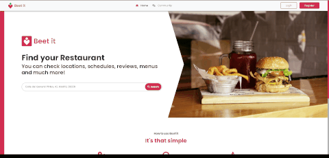

  <strong>🌐 Cambiar idioma:</strong> 
  &nbsp;&nbsp;&nbsp;
 

# 👋 Hola! soy Nacho Puerto

   Soy un programador apasionado por el desarrollo web full-stack y la programación a bajo nivel en 42 Madrid.
    
  &nbsp;
    &nbsp;
    

## 🛠️ Habilidades

  

## 📚 Mis perfiles

  
    

  

    
 &nbsp;Show 42 Profile

    <a href="https://github.com/oakoudad/badge42">
       
      
    </a>
  

  

    
 &nbsp;Show LeetCode Profile

    <a href="https://leetcode.com/u/nachopuerto95/">
        
      
    </a>
  

</table>
 

## 📟 Proyectos en 42 Madrid [Low level, C, C++, Shell] ...

 
<table align="center">
  <tr>
    <th>📁 Proyecto</th>
    <th>💻 Lenguaje</th>
    <th>🔗 Documentación</th>
    <th>ℹ️ Descripción</th>
  </tr>
    <tr>
    <td>🐚 Minishell</td>
    <td>C</td>
    <td></td>
    <td>
        Desarrollo de una Mini Shell personalizada.
    </td>
  </tr>
   <tr>
    <td>🍝 Filósofos</td>
    <td>C</td>
    <td></td>
    <td>
        Solución al clásico problema de los filósofos con sincronización de hilos y mutexes.
    </td>
  </tr>
    <tr>
    <td>♻️ Push_swap</td>
    <td>C</td>
    <td></td>
    <td>
        Algoritmo de ordenación de números con los menores movimientos posibles en dos stacks.
    </td>
  </tr>
  <tr>
    <td>📚 Libft</td>
    <td>C</td>
    <td></td>
    <td>
        Implementación desde cero de las funciones básicas de C.
    </td>
  </tr>
  <tr>
    <td>🧵 Get_next_line</td>
    <td>C</td>
    <td></td>
    <td>
      Función para leer lineas de un file descriptor, administrando buffers y memoria dinámica
    </td>
  </tr>
  <tr>
    <td>🖥️ VMachine</td>
    <td>C</td>
    <td></td>
    <td>
       Introducción a la virtualización y administración de sistemas
    </td>
  </tr>
  <tr>
    <td>🖨️ Ft_printf</td>
    <td>C</td>
    <td></td>
    <td>
        Réplica de la funcion "printf", con funciones variáticas adnministrando formatos buffers y diferentes tipos.
    </td>
  </tr>
  <tr>
    <td>🕹️ So_long</td>
    <td>C</td>
    <td></td>
    <td>
        Juego en 2D utilizando la librería gráfica minilibX y haciendo parsing del mapa con algorithmo Flood Fill.
    </td>
  </tr>
   <tr>
    <td>🖊 Working on more...</td>
  </tr>
</table>

 

## 🌐 Desarrollo Full Stack [Frontend, Backend, Database, Rest API, Grapgic design] ...

 

## Fittracker

<table>
  <tr>
    <td>
       
    </td>
    <td>
        App para hacer un seguimiento del ejercicio e ingesta de calorías  
      ------------------------------------------------------------- 
          
          &nbsp;&nbsp;&nbsp;&nbsp;
               
        
    </td>
  </tr>
</table>

## Restaurants web

<table>
  <tr>
    <td>
       
    </td>
    <td>
       App estilo Just eat, utilizando APIs de google como places, geolocatione etc  
       ------------------------------------------------------------- 
        🚧 En progreso...   
          
            
        
    </td>
  </tr>
</table>

## Reelations

<table>
  <tr>
    <td>
       
    </td>
    <td>
         Red social de cine con diversas funcionalidades.  
      ------------------------------------------------------------- 
          
      &nbsp;&nbsp;&nbsp;&nbsp;
         <a href="https://project-module2.fly.dev/">
            
          </a     
        
    </td>
  </tr>
</table>

## Adventure forest

<table>
  <tr>
    <td>
       
    </td>
    <td>
       Juego 2D "Endless runner", se va acelerando y volviendo más dificil 
      ------------------------------------------------------------- 
          
      &nbsp;&nbsp;&nbsp;&nbsp;
         <a href="https://adventure-forest-nachopuerto.netlify.app/">
            
          </a     
        
    </td>
  </tr>
</table>

